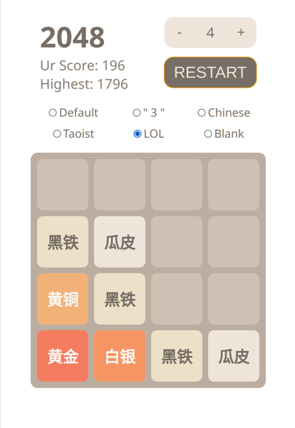

## 2048-game-vue

使用vue构建的2048网页小游戏，可调大小，选择不同文字。PC端使用上下左右键操作，移动端滑动操作



### 构建
请先自行安装node、yarn/npm
```bash
$ git clone https://github.com/arklee/2048-game-vue
$ cd 2048-game-vue
$ yarn install #需要安装yarn，或npm install
```
### 测试

分数保存在scoreData目录中，要存取最高分需要先开启测试服务器。运行以下命令，打开浏览器并访问http://localhost:8080

```bash
$ yarn serve #需要安装yarn，或npm serve
$ node server.js
```

### 打包
运行以下命令将得到dist目录
```bash
$ yarn build #需要安装yarn，或npm build
```
将dist、scoreData、server.js上传至服务器，并修改server.js中的端口号。随后运行node server.js即可（同样需要安装node，并安装express）
